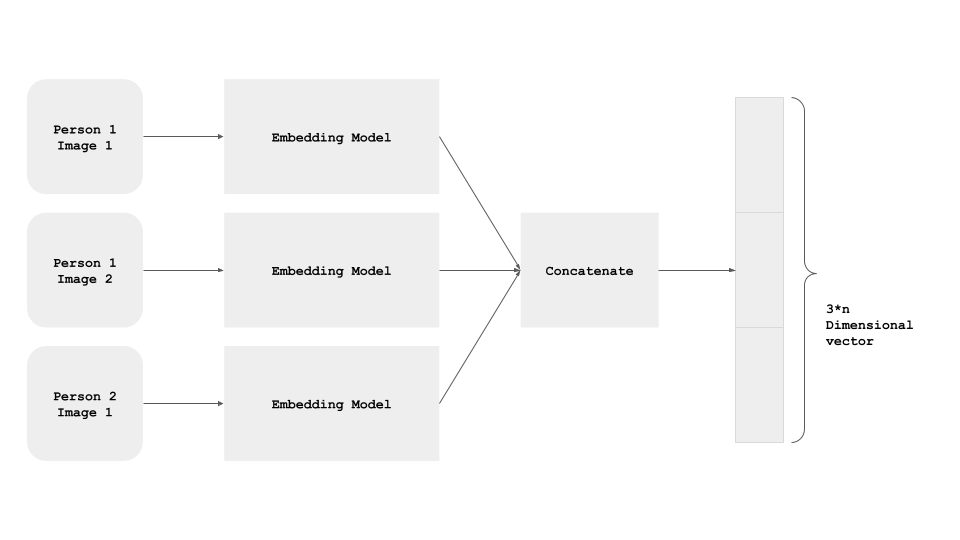
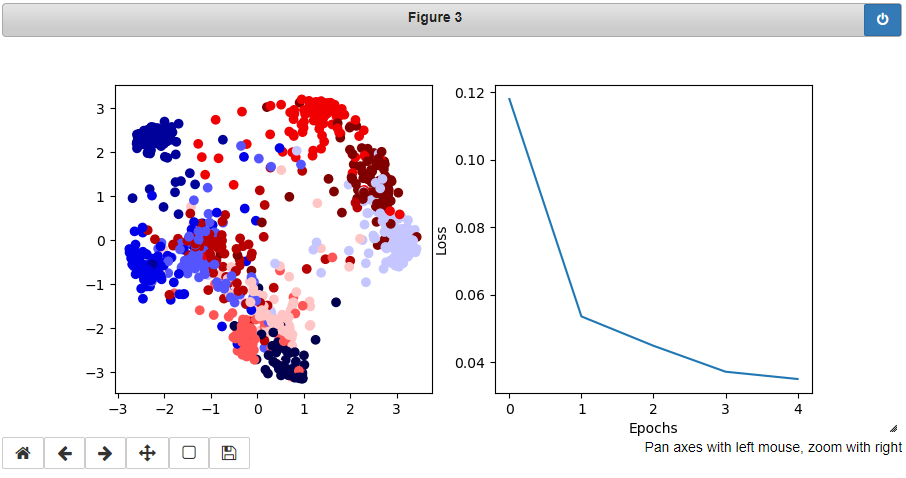

<h1 align="center">Siamese Network with Triplet Los</h1>

<a href="#">
  <div align="center">
    
  </div>
</a>

## Run it now

<a href="https://colab.research.google.com/drive/1g9sez2_UQh64O4QC78UrXECw-ypieAV_?usp=sharing" target="_parent">
    
</a>

# Results
<a href="#">
  <div align="center">
    
  </div>
</a>

# Run Locally

## Requirements
Type below command in cmd to get up and running with the dependencies of the file.
```
git clone https://github.com/saadhaxxan/Siamese-Network-with-Triplet-Loss.git
cd Siamese-Network-with-Triplet-Loss
pip install -r requirements.txt
```
## Usage
```
python Siamese Network.py
```


## Author
You can get in touch with me on my LinkedIn Profile:

#### Saad Hassan
[](https://www.linkedin.com/in/saadhaxxan)

You can also follow my GitHub Profile to stay updated about my latest projects: [](https://github.com/saadhaxxan)

If you liked the repo then kindly support it by giving it a star ⭐!
